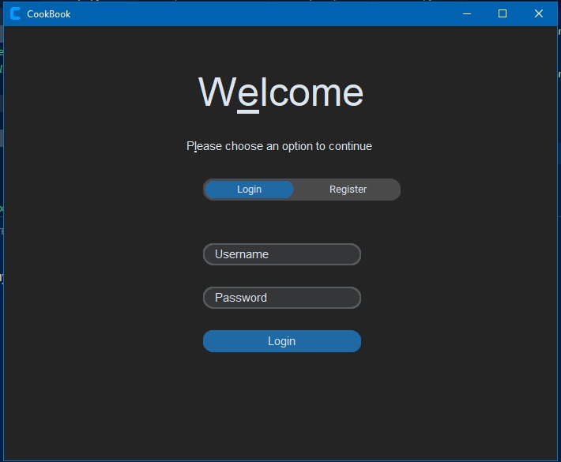
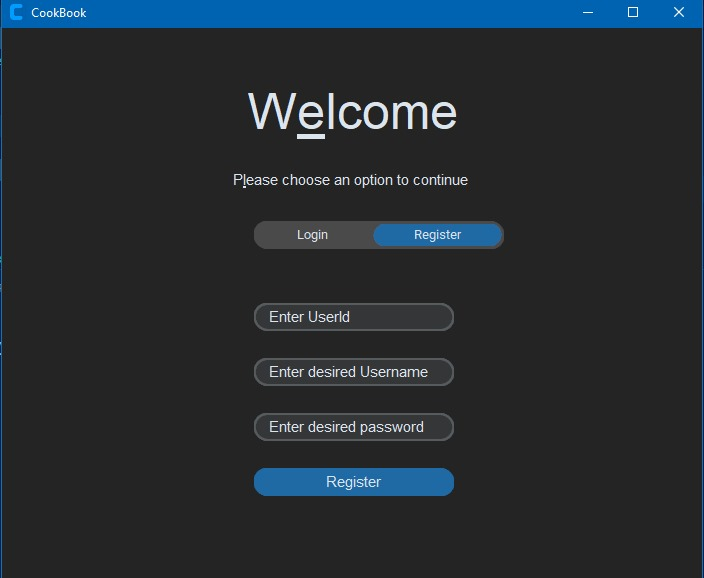
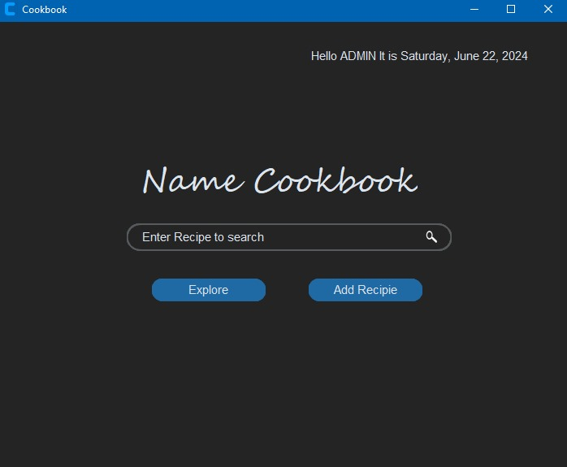
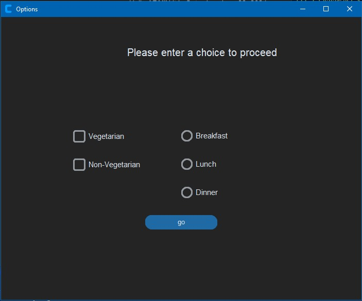
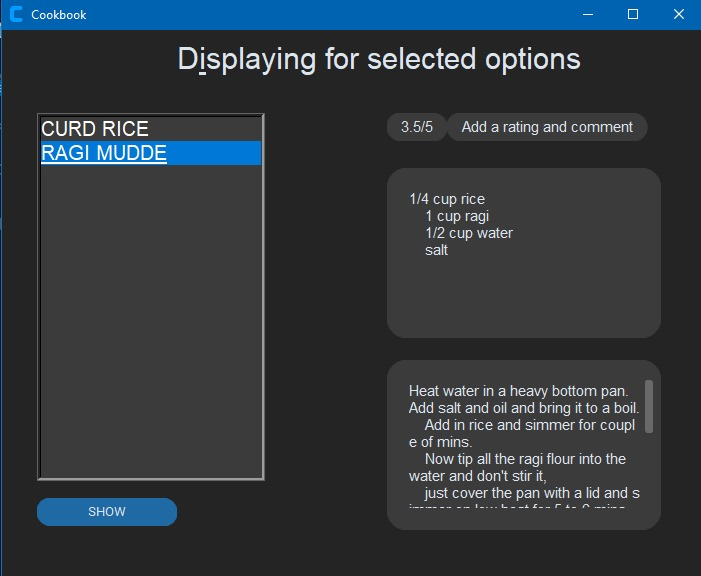
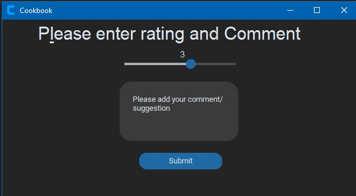
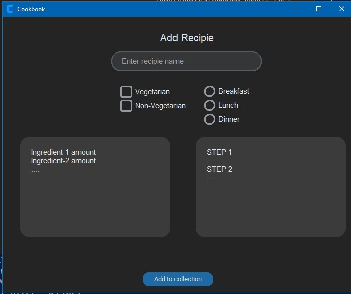
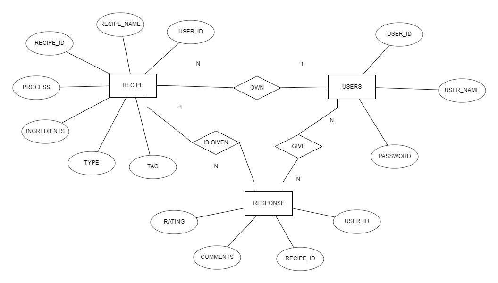
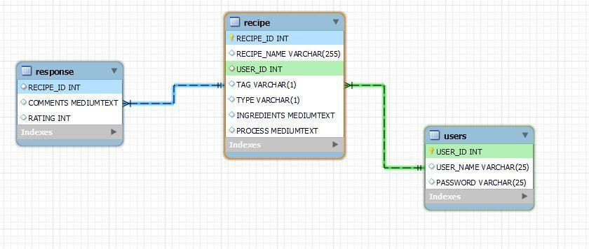

# Recipe Cookbook

Recipe Cookbook is a desktop application that allows users to store, explore, and provide feedback on recipes. The application uses MySQL for database management and Tkinter for the graphical user interface.

## Features

- **User Registration and Login:** Users can register and log in to access the application.
- **Store Recipes:** Users can add new recipes to the database.
- **Explore Recipes:** Users can browse and search for recipes.
- **Leave Feedback:** Users can leave feedback on recipes.

## Installation

### Prerequisites

- Python 3.9.x
- MySQL Server
- `pip` package installer

### Setup

1. **Clone the Repository**:

    ```sh
    git clone https://github.com/Zzabi/Snackzy.git
    cd Snackzy
    ```

2. Install required packages
    ```sh
    pip install requirements.txt
    ```

3. Install MySQL:
   Download and install MySQL from the [official website](https://dev.mysql.com/downloads/).<br>
   Here's a [tutorial](https://www.w3schools.com/mysql/mysql_install_windows.asp)

4. Create a database:
    ```sh
    mysql -u USERNAME -p
    Enter password : *******
    mysql> CREATE DATABASE recipes;
    exit;
    ```

5. Dump sql database:
    ```sh
    mysql -u USERNAME -p recipes<recipes.sql
    ```

6. Alternatively you can skip step 4&5 and run [setup.py](setup.py)
    ```python
    # update the variables as required in line 4&5
    DB_USER = "YOUR MYSQL USER_NAME"
    DB_PASSWORD = "YOUR MYSQL PASSWORD"
    ```
    ```sh
    python setup.py    
    ```


## Usage

1. **Run the Application:**
   Start the application by running the main script:

   ```sh
   python main.py
   ```

2. **User Registration and Login:**
   Users can register by providing a username and password. Once registered, users can log in to access their account.

3. **Add New Recipes:**
   After logging in, users can add new recipes by providing the title, ingredients, and instructions.

4. **Explore Recipes:**
   Users can browse all recipes, search for specific recipes, and view details of each recipe.

5. **Leave Feedback:**
   Users can leave comments on recipes they have tried.


## Screenshots
<table>
  <tr>
    <td></td>
    <td></td>
    <td></td>
  </tr>
  <tr>
    <td></td>
    <td></td>
    <td></td>
  </tr>
  <tr>
    <td></td>
    <td></td>
    <td></td>
  </tr>
</table>
